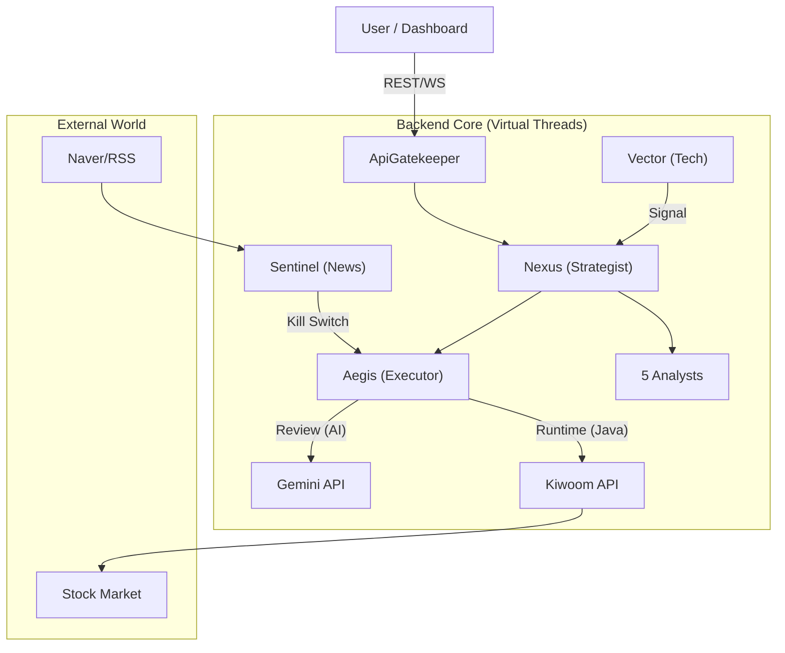

# 🚀 Project KAIROS: High-Frequency Hybrid AI Trading System

> **"Blocking is Fine."** — Java 21 Virtual Threads & 7-Agent System powered by Gemini Pro

---

## 📋 Table of Contents

- [Project Overview](#-project-overview)
- [Key Features](#-key-features)
- [Technology Stack](#-technology-stack)
- [System Architecture](#-system-architecture)
- [Testing Strategy](#-testing-strategy)
- [Project Structure](#-project-structure)
- [Getting Started](#-getting-started)
- [Development Guidelines](#-development-guides)

---

## 🎯 Project Overview

**KAIROS**는 기존 퀀트 시스템의 한계를 넘어, **정성적 분석(AI Reasoning)**과 **정량적 분석(Algorithmic Calculation)**을 결합한 하이브리드 트레이딩 플랫폼입니다.
Java 21의 **Virtual Threads**를 전면 도입하여 I/O Blocking 비용을 제로에 가깝게 만들고, **3-Layer Data Strategy**를 통해 정보의 사각지대를 없앴습니다.

### 🕒 Daily Core Cycle

| Time | Phase | Action |
|---|---|---|
| **08:00~08:30** | **Macro Discovery** | `Sentinel`이 네이버 뉴스로 테마를 발굴하고 `Nexus`가 전략 수립 |
| **08:40~09:00** | **Pre-Market** | `Aegis`가 갭상승 과열 종목 필터링 및 장전 준비 |
| **09:00~15:20** | **Micro Execution** | `Vector`(Java)가 NanoBanana 패턴 포착 → `Aegis`가 즉시 주문 |
| **15:20~15:30** | **Liquidation** | 오버나잇 리스크 제거를 위한 전량 매도 (Day Trading 원칙) |
| **15:40~** | **Post-Market Review** | `Aegis`(AI)가 슬리피지 원인을 분석하고 `Nexus`가 전략 수정 |

---

## ✨ Key Features

### 1. 7-Agent System (Hybrid Intelligence)

단순한 챗봇이 아닌, **역할(Persona)과 책임(Responsibility)**이 명확한 7개의 독립 모듈이 협업합니다.

- **Analysts (Speed/Flash)**: Sentinel(뉴스), Axiom(재무), Vector(차트), Resonance(심리), Sonar(수급)
- **Strategist (Brain/Pro)**: Nexus (최종 의사결정 및 리스크 관리)
- **Executor (Speed/Java)**: Aegis (자금 관리, 호가 스프레드 계산, 주문 집행)

### 2. Dual-Mode Architecture

- **Runtime (장중):** AI 개입을 배제한 **100% Java Algorithm**으로 1ms 내 주문 집행 (Zero Latency).
- **Post-time (장후):** **Gemini Pro/Flash**를 활용한 심층 매매 복기 및 전략 고도화.

### 3. Global Traffic Governance

- `ApiGatekeeper`를 통한 중앙 집중식 API 쿼터 관리.
- **Kiwoom:** 초당 4회 (Strict Leaky Bucket)
- **Gemini:** Pay-as-you-go 모델 기반의 고속 처리 (Safety Cap 적용)

### 4. NanoBanana Algorithm

이동평균선이 밀집(Squeeze)된 상태에서 거래량이 폭발하며 확산(Expansion)하는 구간을 포착하는 독자적 스캘핑 알고리즘입니다.

---

## 🛠 Technology Stack

### Backend

- **Core:** Java 21 LTS (Virtual Threads Required)
- **Framework:** Spring Boot 3.5.7
- **AI Integration:** LangChain4j + Google Gemini API (Pro/Flash Mix)
- **Networking:** `RestClient` (Synchronous), `ReactorNetty` (WebSocket)
- **Concurrency:** Structured Concurrency, Bucket4j (Rate Limiting)
- **Persistence:** PostgreSQL / H2, Spring Data JPA, HikariCP

### Frontend

- **Core:** React 19, Vite, TypeScript
- **Architecture:** FSD Lite (Feature-Sliced Design)
- **State:** TanStack Query v5 (Server), Zustand (Global)
- **UI:** Shadcn UI, Tailwind CSS, Recharts

---

## 🏗 System Architecture



---

## 🧪 Testing Strategy (Strict Rules)

### 1. Coverage Quality Gate

Build pipeline will fail if coverage drops below thresholds.

- **General Domain:** 80% Line Coverage.
- **Execution Domain (`domain.execution`):** **95%** Line Coverage (Must-have).

### 2. Market Simulator (Integration Test)

`MarketSimulatorTest` validates the full cycle:
> `Data Injection` -> `Signal Detection` -> `AI Decision` -> `Order Execution` -> `Balance Update`

- Validates the organic connection between Java algorithms and AI agents.

---

## 📁 Project Structure

```Bash
KAIROS/
├── backend/                 # Spring Boot
│   ├── domain/             # Domain-Driven Design
│   │   ├── news/           # Sentinel
│   │   ├── strategy/       # Nexus
│   │   ├── execution/      # Aegis (Java + AI)
│   │   └── ...
│   ├── global/
│   │   ├── config/         # App Config
│   │   └── infra/          # ApiGatekeeper, RateLimiter
│   └── ...
│
├── frontend/                # React 19
│   ├── app/                # Providers, Routes
│   ├── features/           # Business Logic (Chart, Order)
│   ├── entities/           # Data Models (Stock, Account)
│   └── shared/             # UI Kit, Utils
│
└── docs/                   # Documentation (SSOT)
    ├── PROJECT-Specification.md  # Detailed Spec
    ├── Master_Plan.md            # Roadmap
    ├── AI_Agent_List.md          # Agent Persona
    └── INT_API_Specification.md  # API Contract
```

---

## 🚀 Getting Started

### Prerequisites

- **Java 21+** & **Node.js 24+**
- **Google Cloud Project** (Gemini API Enabled, Billing Set)
- **Kiwoom Open API** Account (Mock Trading Recommended)

### Quick Start

1. **Clone & Config**

    ```bash
    git clone https://github.com/your-repo/kairos.git
    cp backend/src/main/resources/application.yml.example backend/src/main/resources/application.yml
    # Set GEMINI_API_KEY, KIWOOM_APP_KEY inside application.yml
    ```

2. **Backend Run**

    ```bash
    cd backend
    ./gradlew bootRun
    ```

3. **Frontend Run**

    ```bash
    cd frontend
    npm install
    npm run dev
    ```

---

## 👨‍💻 Development Guides

### 1. Blocking is Fine

Virtual Threads를 사용하므로 복잡한 비동기(`CompletableFuture`, `Flux`) 대신 직관적인 **동기(Blocking) 코드**를 작성하세요. `RestClient` 사용을 권장합니다.

### 2. Rate Limit First

모든 외부 API 호출(Kiwoom, Naver, Gemini)은 반드시 `ApiGatekeeper`를 통해야 합니다. 이를 우회하여 직접 호출할 경우 계좌 동결(Ban)이나 과금 폭탄의 위험이 있습니다.

### 3. Dual-Mode Aegis

장중 실시간 매매 로직(`TradeExecutionService`)에는 **절대 AI 호출 코드를 포함하지 마십시오.** 속도와 안정성이 최우선입니다. AI 기반 분석은 장 마감 후 `PostTradeAnalyzer`에서만 비동기로 수행합니다.

---

## 📜 License

This project is proprietary software. Unauthorized copying is strictly prohibited.
